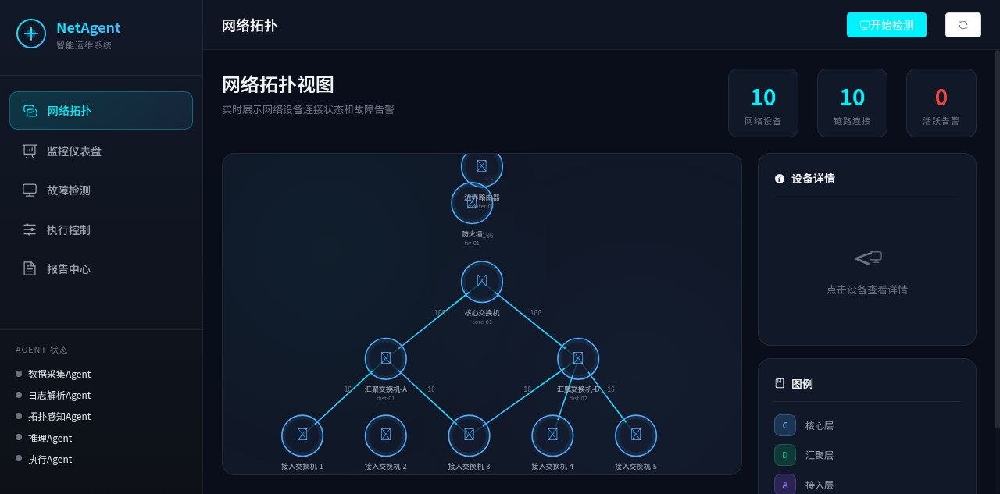
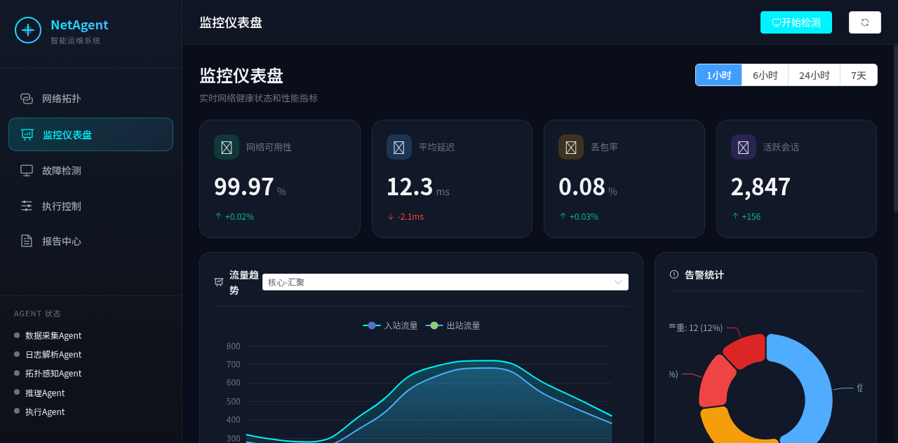
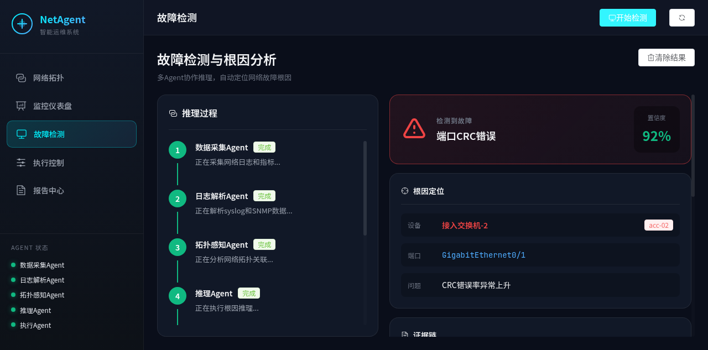

# Network Fault Analysis Agent - 网络故障根因定位与自愈系统

## 项目概述

自动检测企业内网中的网络故障（如丢包、断连、高延迟），定位根本原因（具体交换机端口、链路或设备），并执行自动恢复动作。

## 界面展示

| 网络拓扑 | 监控仪表盘 | 故障检测 |
|---------|-----------|---------|
|  |  |  |

## 核心特性

- **多 Agent 协作**: 数据采集Agent、日志解析Agent、拓扑感知Agent、推理Agent、执行Agent
- **长链推理**: 原始日志/指标 → 时序异常检测 → 拓扑关联 → 逐跳排除 → 根因推断 → 自愈决策
- **可解释性输出**: 每一步推理都有明确的判断依据和证据链
- **实时可视化**: 网络拓扑、监控仪表盘、推理过程全链路展示

## 快速开始

### 前端 (Vue 3)

```bash
cd frontend
npm install
npm run dev
# 访问 http://localhost:3000
```

### 后端 (Python FastAPI)

```bash
cd backend
pip install -r requirements.txt
python main.py
# API 文档 http://localhost:8000/docs
```

## 项目结构

```
network-agent/
├── frontend/                    # Vue 3 前端
│   └── src/
│       ├── views/               # 页面组件
│       │   ├── TopologyView.vue  # 网络拓扑可视化
│       │   ├── DashboardView.vue # 监控仪表盘
│       │   ├── DetectionView.vue # 故障检测与推理
│       │   ├── ExecutionView.vue # 命令执行控制台
│       │   └── ReportView.vue    # 报告中心
│       └── stores/agent.js       # 状态管理
│
└── backend/
    └── agents/
        ├── agents.py            # 5个 Agent 实现
        ├── workflow.py          # 工作流编排
        └── simulator.py         # 模拟数据生成器
```

## 架构说明

### Agent 协作流程

```
数据采集Agent → 日志解析Agent → 拓扑感知Agent → 推理Agent → 执行Agent
     ↓              ↓               ↓             ↓          ↓
  Syslog/SNMP    异常检测        拓扑构建      根因定位    修复方案
```

### 根因分析输出示例

```json
{
  "device": "acc-02",
  "device_name": "接入交换机-2",
  "port": "GigabitEthernet0/1",
  "issue": "端口物理损坏导致CRC错误率异常",
  "confidence": 0.92,
  "evidence": [
    {"type": "syslog", "content": "CRC errors increased from 0.01% to 2.3%"},
    {"type": "snmp", "content": "ifInErrors: 23456 (threshold: 100)"},
    {"type": "metric", "content": "Packet loss: 5.2% (threshold: 1%)"}
  ]
}
```

## 部署指南

### 生产环境组件替换

| Demo 组件 | 生产环境替换 |
|-----------|------------|
| 模拟 Syslog | rsyslog + Logstash + Elasticsearch |
| 模拟 SNMP | Prometheus SNMP Exporter |
| 规则推理引擎 | OpenAI GPT-4 / Claude API |
| 设备配置管理 | NetConf/YANG + PyEZ/Junos PyEZ |

### Docker 部署

```dockerfile
# frontend/Dockerfile
FROM nginx:alpine
COPY dist/ /usr/share/nginx/html/

# backend/Dockerfile
FROM python:3.11-slim
WORKDIR /app
COPY requirements.txt .
RUN pip install -r requirements.txt
COPY . .
CMD ["uvicorn", "main:app", "--host", "0.0.0.0", "--port", "8000"]
```

## API 接口

- `GET /api/status` - 获取 Agent 状态和拓扑
- `GET /api/topology` - 获取网络拓扑
- `GET /api/logs` - 获取 Syslog 日志
- `GET /api/metrics` - 获取 SNMP 指标
- `POST /api/detect` - 启动故障检测
- `POST /api/detect/stream` - 流式推理过程
- `POST /api/execute` - 执行修复命令

## License

MIT
